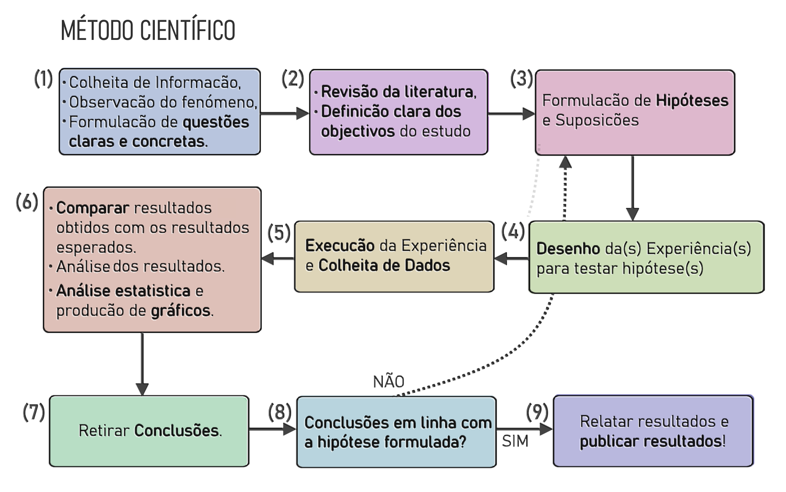

# ✍️ Repositório de Escrita Científica e Métodos de Investigação

Bem-vindo ao Repositório de Escrita Científica e Métodos de Investigação! 🔬 

  

Este repositório é uma coleção de recursos, textos de referência e ferramentas úteis para apoiar os investigadores nos seus esforços de escrita científica e investigação no CIIC. Pode aceder ao conteúdo do repositório diretamente através das ligações e ficheiros fornecidos.

## Links Úteis

- ✨[Guias de apoio à pesquisa e elaboração de trabalhos académicos do I.P.Leiria](https://www.ipleiria.pt/sdoc/guia/)
- [Google Académico - motor de busca de virtual de literatura académica](https://scholar.google.com/schhp?hl=pt-PT)
- [Papers with code! - repositório de artigos sobre aprendizagem automática, código fonte e conjuntos de dados](https://paperswithcode.com/)

## Utilização
Navegue no repositório e utilize os recursos que se adequam às suas necessidades. Também está convidado a contribuir, adicionando novos recursos, atualizando os existentes ou sugerindo melhorias. Agradecemos a sua colaboração para fazer deste repositório um recurso valioso e abrangente para a comunidade de investigação do CIIC. 
