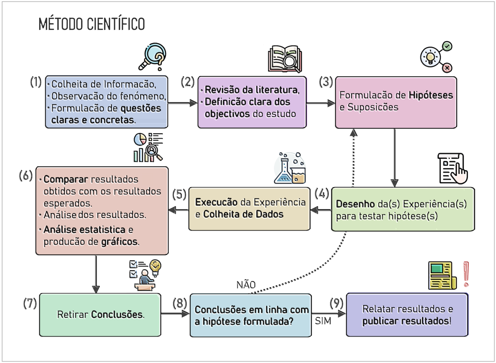

# ✍️ Escrita Científica e Métodos de Investigação

Bem-vindo ao Repositório de Escrita Científica e Métodos de Investigação! 🔬 

  

Este repositório é uma coleção de recursos, textos de referência e ferramentas úteis para apoiar os investigadores nos seus esforços de escrita científica e investigação no grupo de Comunicações e Telemática do CIIC.

## Links Úteis

### 🔥 Destaques
- ✨[**Guia de Apoio do I.P.Leiria**: Apoio à pesquisa e elaboração de trabalhos académicos](https://www.ipleiria.pt/sdoc/guia/) 
- ✨[**I.P.Leiria-Thesis**: Modelo LaTeX adaptado a teses, dissertações e relatórios de projectos](https://github.com/joseareia/ipleiria-thesis)
- ✨[**b-on**: Biblioteca com a acesso periódicos e ebooks das principais editoras científicas internacionais](https://www.b-on.pt/)
- [**Tools for Academic Research** : Compilação de ferramentas e recursos para investigadores](https://tools.kausalflow.com/) 

### 📚 Repositórios Trabalhos Científicos e de Formação
- ✨[**OpenAlex** - Repositório abrangente, de código aberto de ublicações académicas](https://openalex.org/)
- ✨[**arXiv** - Repositório de acesso aberto para preprints de artigos científicos](https://arxiv.org/)
- ✨[**IC-Online** - Repositório Institucional de Informação Científica do I.P.Leiria](https://ic-online.pt/)
- [**RCAAP** - Repositórios Científicos de Acesso Aberto de Portugal](https://www.rcaap.pt/)
- [**Google Académico** - Motor de busca de literatura académica](https://scholar.google.com/schhp?hl=pt-PT)
- [**Web of Science** - Revistas e literatura científica, atas de conferências em várias disciplinas](https://www.webofscience.com/)
- [**IEEE Xplore** - Repositório focado em eng. elétrica, ciência da computação e eletrónica](https://ieeexplore.ieee.org/)
- [**ACM Digital Library** - Coleção de publicações da Association for Computing Machines](https://dl.acm.org/)
- [**SpringerLink** - Literatura científica, técnica e médica,processamento de imagem, visão computacional](https://link.springer.com/)
- [**Scopus** - Base de dados de literatura revista por pares](https://www.scopus.com/)
- [**PubMed** - Base de dados de acesso aberto de literatura biomédica](https://pubmed.ncbi.nlm.nih.gov/)
- [**ScienceDirect** - Plataforma de acesso a literatura científica, técnica e médica](https://www.sciencedirect.com/)

### 🔍 Ferramentas de Sumarização e Interação com Artigos
- [**Synthical** - Funcionalidades sumarização e explicação de artigos científicos abertos](https://synthical.com/)
- [**Consensus** - Evidence-Based Answers, Faster](https://www.searchconsensus.com/)
- [**Paper Digest**: Digestão de artigos](https://www.paperdigest.com/)
- [**Explainpaper**: Explicação de artigos científicos](https://www.explainpaper.com/)
- [**Elicit:** The AI Research Assistant](https://elicit.ai/)

### 🧠 Mapeamento de Organização de Literatura
- [**Research Rabbit:** Ferramentas de pesquisa](https://researchrabbit.ai/)
- [**Litmaps** - Ferramenta para descobrir e organizar literatura académica](https://app.litmaps.co/)

### 📚 Gestores de referências bibliográficas
- [**Zotero**: Zotero é uma ferramenta gratuita e de código aberto para gestão de referências bibliográficas](https://www.zotero.org/).
- [**Mendeley**: Plataforma de gestão de referências](https://www.mendeley.com/).
- [**EndNote**: Software pago de gestão de referências, criação de citações e gestão de documentos de pesquisa](https://endnote.com/).

### 🕵️ Ferramentas de Inspeção e Verificação de Texto
- [**ZeroGPT** - Chat GPT, Open AI and AI text detector Free Tool](https://zerogpt.com/)
- [**Edit Pad** - Verificação de Plágio.](https://www.editpad.org/tool/br/plagiarism-checker)

### 📈 Ferramentas para Criação de Diagramas
- ✨[**Google Drawings** - Diagramas e esquemas de forma simples e intuitiva](https://docs.google.com/drawings/)
- [**Lucidchart** - Criação online de diagramas, fluxogramas, organogramas e mais](https://www.lucidchart.com/)
- [**Miro** - Ferramenta colaborativa para diagramas técnicos entre outros](https://miro.com/pt/diagramas-tecnicos/) 

### 🌐 Fontes e Conjuntos de Dados
- [**Papers with code!** - Artigos de aprendizagem automática, código fonte e conjuntos de dados](https://paperswithcode.com/)
- [**UC Irvine Machine Learning Repository**: Conjuntos de Dados](https://archive.ics.uci.edu/ml/index.php)
- [**Zenodo** - Research. Shared.](https://zenodo.org/)
- [**IEEE Dataport** - Repositório de  Conjuntos de dados da IEEE](https://ieee-dataport.org/datasets)

### 📊 Ferramentas e Recursos de Estatística
- [**Statisticshowto**: Choosing the Correct Statistical Test in SAS, Stata, SPSS and R](https://www.statisticshowto.com/)

### Outros
- [**Portal APPIA** – Associação Portuguesa Para a Inteligência Artificial](https://www.appia.pt/)

## Utilização
Navegue no repositório e utilize os recursos que se adequam às suas necessidades. Também está convidado a contribuir, adicionando novos recursos, atualizando os existentes ou sugerindo melhorias. Agradecemos a sua colaboração para fazer deste repositório um recurso valioso e abrangente para a comunidade de investigação do CIIC. 

## Acerca do Grupo de Investigação

Conheça melhor o nosso grupo de investigação em Comunicações e Telemática, além de toda a estrutura e atividades, projetos e recursos no site do CIIC.

    

